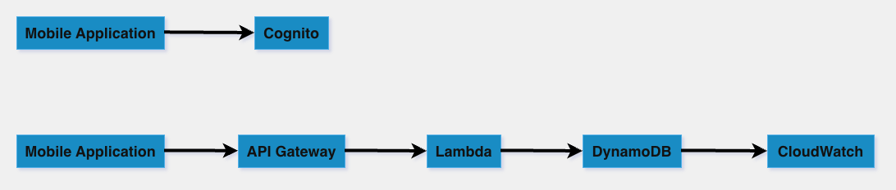

# FitNest

FitNest is a mobile fitness tracking app built with React Native (Expo) and AWS serverless services.

## V1 Architecture

## Tech Stack

### Frontend
- React Native (Expo)
- TypeScript

### Backend (AWS Serverless)
- API Gateway
- Lambda
- DynamoDB
- CloudWatch

## Features (V1)

- Add workout
- Store workout in DynamoDB
- Basic validation and error handling